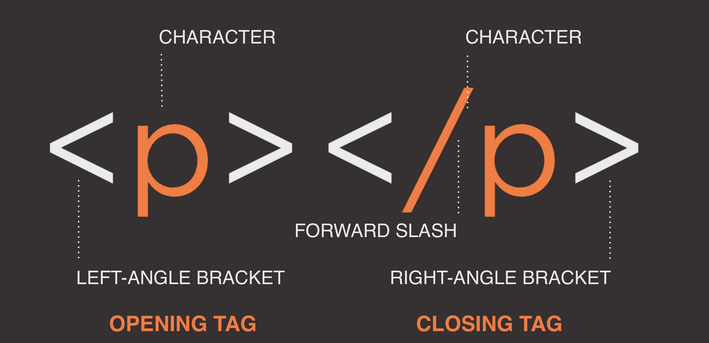
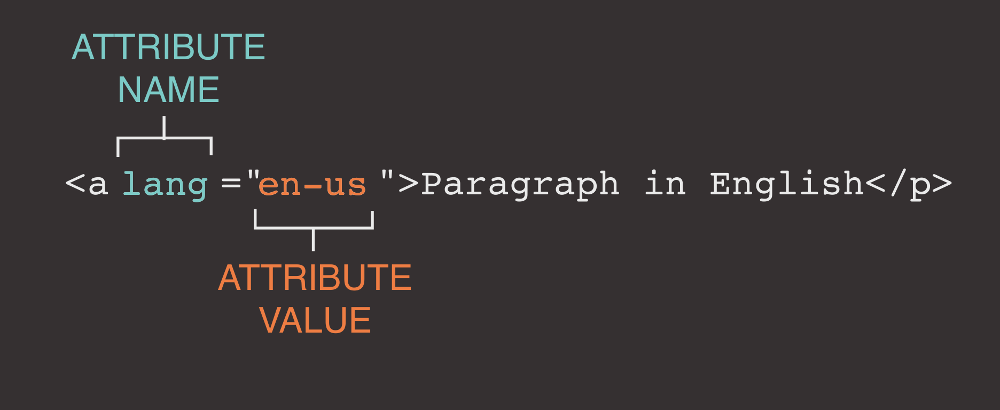

# The Word Wide Web

The World Wide Web (WWW), commonly known as the Web, is
an information system where documents and other web resources are
identified by Uniform Resource Locators (URLs, such as https://example.com/),
which may be interlinked by hyperlinks, and are accessible over the Internet. The
resources of the Web are transferred via the Hypertext Transfer Protocol (HTTP), may
be accessed by users by a software application called a web browser, and are
published by a software application called a web server. The World Wide Web is not
synonymous with the Internet, which pre-dated the Web in some form by
over two decades and upon which technologies the Web is built.”

- invented by Tim Berners-Lee in 1989
- Browser wars
- W3C and WHATWG conflicts:
  - The had been publishing competing standards since 2012
  - W3C wanted to publish a "finished" version of HTML5
  - WHATWG wanted to continue working on a living standard for HTML
  - May 2019: 2 entities signed an agreement to work together on a single HTML version
- W3C = World Wide Web Consortium
- WAI = Web Accessibility Initiative

## Web Accessibility and WAI

>The power of the Web is in its universality. Access by everyone regardless of disability is an
essential aspect.” – Tim Berners-Lee

- Accessible Websites provide accommodations that help individuals to individuals with visual, auditory, physical, and neurological disabilities overcome barriers

## Web Development

- Process of developing websites or webpage on the internet or intranet
- Divided into:
  - Client-Sie Coding
  - Sever-Side coding
  - Database Technology

### Client-Side stack

- HTML & CSS, JavaScript, JS Libraries, JS Frameworks
- Tools: Grunt, gulp, webpack, etc.

### What is HTML used for?

- **Structure**
  - Text, Lists, Links, Images, Tables, Forms, Audio, Video

### What is CSS used for?

- **Presentation and Layout**

## A closer looks at Tags



## Attributes tell us more about Elements



## Body, Head and Title

```html
<head>
  <title>This will show up in the Tab Name</title>
</head>
```

```html
<body>
  <h1>Main Content</h1>
  <p>This is the Body</p>
</body>
```
