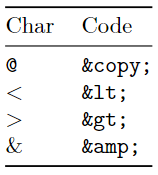
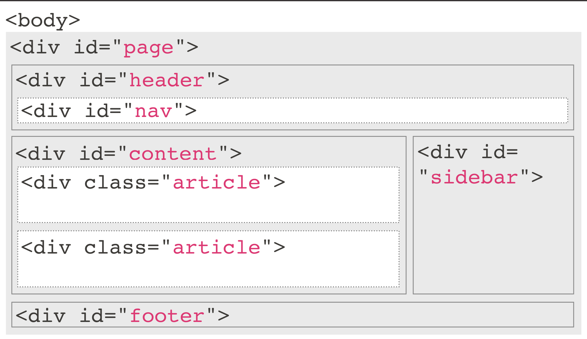

# Questions

How many lists are ther: 3
In HTML5, which tag is used for acronyms? `<abbr>`
Whats the difference between `<strong>` and `<b>` ? Strong has an emphasis (semantik/meaning)

# Lecture 3

## Special Entity Characters:



Using escapes can make it difficult to read and maintain source code, and can also
significantly increase file size.

## HTML Validation

### Validation

### Validation Problems

#### Some closing tags in HTML5 are optional

Some of them are:

```html
<html>
<head>
<body>
<dt>
<dd>
<li>
<p>
<td>
<th>
```

```html
<ul>
	<li>(</li>)
	<li>(</li>)
</ul>
```

```html
<p>
...
```

##### Pros

- Speeds up your pages
- Size?

##### Cons

- Bad rwadability
- Less maintainability
- Automatic tools might not work well. For example automatic format coding

!! Close, Format, Validate !!

### Comments

```html
<!-- comment -->
<!--
comment 2
-->
```

## ID Attribute

Used to uniquely identify one element within a page.
It is used by CSS and JavaScript.
`<p id="pullquote">iridn</p>`

## Class Attribute

- Used to distinguish more than one element as being
- used for a specific purpose.

`<p class="imprtant admittance">igirsgn</p>`

- Can have multiple values
- CSS Classes are applied in order of class

## Default display value

Every HTML element has a default display value depending on what type of element it is. The default display value for most elements is block or inline.

### Block Elements

- starts on a new line
- takes up the full width available

### Inline Elements

- Does not start on a new line
- takes up as much width as necessary
- For example: `<em>, <b>`

## Grouping Elements

### div

- Groups elements into a block-level element
- (Takes the whole block/space). Eg. Background colour for a paragraph \rightarrow We group those with div

### span

- Groups elements inline
- For example: When you have two words that need to be in one Group, so we can apply something to it (for example `<b>Two </b>, <b> Words</b>` \rightarrow To apply the same css \rightarrow `<span><b>Two</b> <b>Words</b>`)

```html
<p> Some <span class="gallery">Something</span> something else.</p>
```

## Structural semantic tags

`<header>, <nav>, <footer>, <main>, section, article, aside, ...`

same as `<div id="header">,...`

- Does it has to be an Article? Ask yourself if it makes sense if the object has it's own url \rightarrow if yes it can be an article

- Header `<heaer></header>` Contains the headings
- nav element
- Main element `<main></main> contains the main content`
- Footer Element `<footer></footer>` contains the footer

- Section Element: indicates a portion or "section" of a document, like a chapter or topic
- Article Element: indicates an independent entry, like a blog posting, **that can stand on it's own**
- Aside Element: indicates a sidebar or other tangential content
- Time Element: represents a date or time

## Relative and absolute paths

images are void elements (dont need a closing tag)

## Anchor Elements

- Anchor elements are denoted by the `<a>` tag, and are used to link to other pages, resources or content inside the same page
- Used for links to other sites or headings: `<a href="http://www.imdb.com">IMDB</a>`
- Adding `target="_blank"` will open it in another tab
- (Can take absolute and relative paths)
- To link to another resource on the same site: `<a href=”index.html”>Home</a>` (relative)
- Can also link to ID of html element `<a href="#top">Top</a>`
- E-Mail or telephone: `<a href="mailto:jon@example.org">Email Jon</a>` or `tel:+12435654`

## Images

```html

```

- The alt text cannot be displayed
- The title gives a tooltip
- Is a void element (no closing tag, just `img`)
