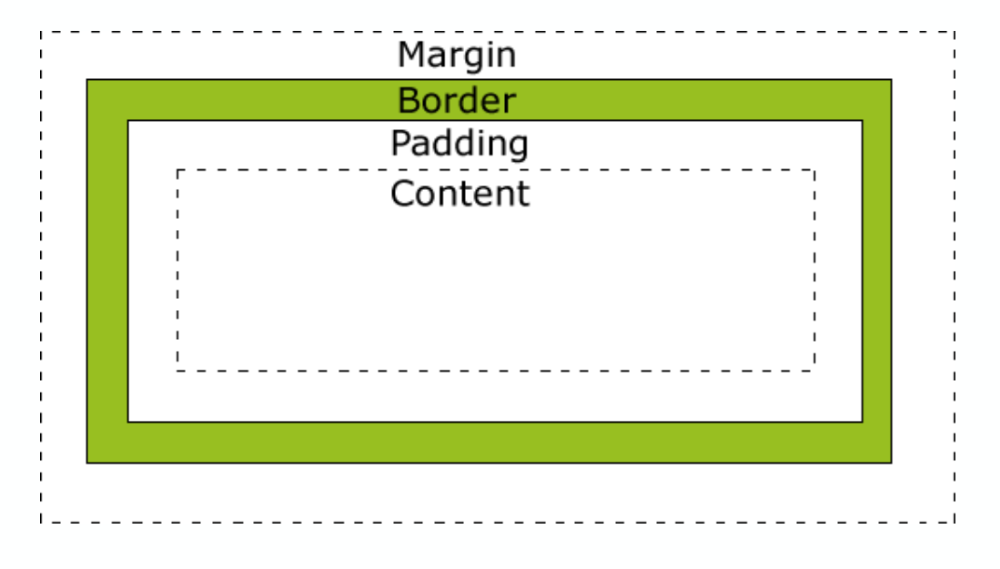
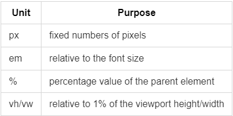

# Cascading Style Sheet

## What CSS does

Cascading Style Sheet (CSS) allows you to create rules that specify how the content od an element should appear => Control the design of web pages to make them more attractive

### CSS Associates style rules

```css
p {
    font-family: Arial;
}
```

`p` = selector
`font-family: Arial;` = declaration

- Multiple elements can be addressed when listing them with `,` \rightarrow `h1, h2, ... {}`
- It's always `property: value;`

```css
h1, h2, h3 {
    color: yellow;
    (property: value)
}
```

### CSS Advantages

- Greater typography and page layout control
- Style is separate from structure
- Styles can be stored in a separate document and associated with many web pages
- Potentially smaller documents
- Easier site maintenance

## Bringing CSS and HTML together

- Using inline styles
  - Using the `style` HTML attribute
  - Apply only to the specific element
- Using internal CSS (embedded styles)
  - Configured in the `<head>` element
  - Apply to the entire document
- Using external CSS
  - Styles are configured in a separate file
  - The `<link>` element is used at the `<head>` of the document to associate the page with the styles
- Using imported styles (`@import` directive) - not relevant for now...

```html
<!DOCTYPE html>
<html lang="en">
   
  <head>
       
    <meta charset="UTF-8" />
       
    <meta name="viewport" content="width=device-width, initial-scale=1.0" />
           
    <!-- this is external css. rel is required, specifies the relationship between
    current document and the linked resource -->
       
    <link rel="stylesheet" href="src/style.css" />
           
    <!-- this is internal/embedded css -->
       
    <style>
            h1 {
              color: red;
            }
         
    </style>
     
  </head>
   
  <body>
       
    <!-- this is internal css, should not be in body -->
       
    <style type="text/css">
            h1 {
              color: yellow;
            }
         
    </style>
           
    <!-- this is inline css -->
       
    <h1 style="color: white;">Hi friend, try change my color!</h1>
     
  </body>
</html>
```

-> Text will appear white, even if other statements say otherwise

The last mentioned style is preferred. If the external and embedded CSS modify the same element, the last in order will be used.

### Why use External Stylesheets?

- Same CSS can be used for every page of website
  - DRY => Don't repeat yourself
- No need to copy style code into each webpage
- Changes to CSS automatically apply to the entire website
- Easier to for many people to create new pages in same style

### CSS Selectors

- Universal: `* { }`
- type `h1, h2, h3 {}`
- Class `.note {} p.note {}`
- ID `#introduction {}`
- Child (direct descendants/first level) `li>a {}`
- Descendent (all) `p a {}`
- Adjacent sibling (only the first `p` after every `h1` at the same level) `h1+p {}`
- General sibling (same level of hierarchy and every p sibling of h1 \rightarrow everything after h1 at the same level)`h1~p {}`

### Specificity

If there are two or more CSS rules that point to the same element, the selector with the highest specificity will "win", and its style declaration will be applied to that HTML element.

`*` < selector < class < ID

When I use the ID to transform an object, it will overwrite the `*`, the normal selector (for example `p`) and the class (for example `#my-class`)

### Inheritance

- Some styles are inherited (e.g.: fon-family)

```css
body {
  font-family: Arial, sans-serif;
  color: #665544;
  padding: 10px;
}
.page {
  border: 1px solid #665544;
  background-color: #efefef;
  padding: inherit;
}
```

## CSS colour representation

```css
p {
  color: red; /*color name*/
  color: #ff0000; /*hex*/
  color: #f00; /*shorthand hex*/
  color: rgb(255, 0, 0); /*decimal rgb triplet*/
  color: rgba(255, 0, 0, 0.5); /*decimal rgb + opacity from 0 to 1*/
  color: hsl(0, 100%, 50%); /*hsl color*/
}
```

### Foreground color

`color: DarkCyan`

<p style="color: DarkCyan">Text</p>
`background-color: DarkCyan`
<p style="background-color: DarkCyan">Text</p>

## CSS The box Model



- Text will appear in content box
- Clear area around is padding
- border that goes around the padding and content
- followed by clear margin area

### Some things we can do with boxes

- Set the dimensions of a box (width and height)
- Configure the margin, border and padding
- Style boxes:
  - Center web page contents
  - Apply shadows
  - Configure rounded corners
  - Hide/show boxes

### CSS Dimensions



### CSS Width and Height Properties

- width:
  - configures the width of an elements content
- min-width property:
  - Configures minimum width of an element
- max-width:
  - configures the maximum width of an element
- height
  - configures the height of an element (also has max and min height)

**Important:**

- When you set the width and height properties of an element with CSS, you just set the width and height of the content area. To calculate the full size of an element, you must also add padding, borders and margins. \rightarrow content = height/width
- By default in the CSS box model, the width and height you assign to an element is applied only to the element's content box. If the element has any border or padding, this is then added to the width and height to arrive at the size of the box that's rendered on the screen. This means that when you set width and height, you have to adjust the value you give to allow for any border or padding that may be added.
- The entire box (content+padding+border+margin = total height/width)
- Or setting the property `box-sizing` to `border-box`

!!!
    `box-sizing: border-box;`

### Margin & Padding & Border

#### Margin

- The margin property
- Related properties: margin-top, margin-right, margin-left, margin-bottom
- Configures empty space between element and adjacent elements
- Syntax emaples: `margin: 0;`, `margin: 20px 10px;`, `margin: 10px 30px 20px;`, `margin 20px 30px 0 30px;`

#### Padding

- related properties: padding-top, padding-right, ...
- Configures empty space between the content of the HTML element (such as text) and the border
- Same syntax as in margin

#### Border

- Configures a border on the top, right, bottom, and left sides of an element
- Consists of: border-width, border-style, border-color
- Shorthand: `border: 2px solid #ff0000`
- Other styles: default, none, inset, outset, double, groove, ridge, solid, dashed, dotted

## Display and Visibility

Change inline/block

```css
li {
  display: inline;
}
li.coming-soon {
  display: none; /*removes it from the flow*/
  display: hidden; /*just makes it invisible*/
}
```

## Styling

### Centering page content with CSS

```css
#container {
  margin-left: auto;
  margin-right: auto;
  width: 80%;
  /*margin: 0 auto; is the same*/
}
```

### Box-shadow property

- Configure the horizontal offset, vertical offset, blur radius, and valid color value
- Example: `box-shadow: 5px 5px 5px red`

### Rounded Corners

- Border-radius property
- Example: `h1 {border: 1px solid black; border-radius: 15px; }`
- `border-radius: 0 0 100% 0;` just like margin
