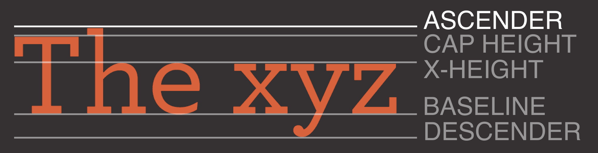
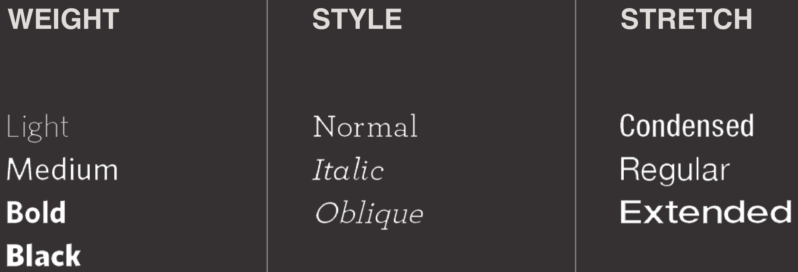
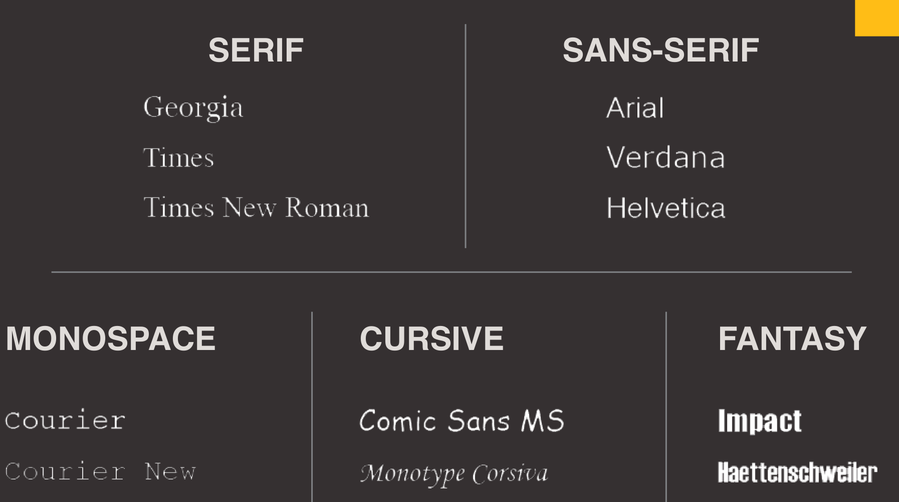
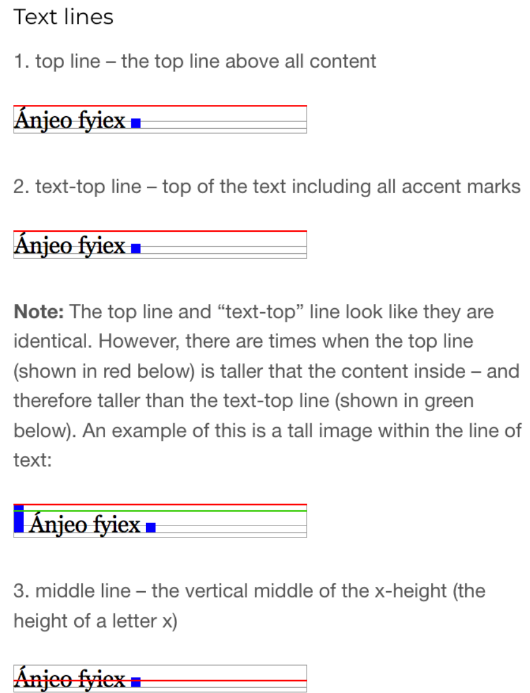

# Questions:

1. CSS treats each element as if it creates its own **BOX**
2. Whats the difference between total hight/width and hight/width? \rightarrow total is everyhting (Padding, Margin, ...), width/hight alone is applied to the content alone (not the stuff arrounf)
3. Whats the difference between `display:none` and `visibility:hidden`?\rightarrow`Display:none` removes the element (removes it, as it does not exists), `visibility:hidden just does not show it (gaps would still stay)
4. Which selector would you use to only select ALL the CHILDREN sitting inside a `<div>`? \rightarrow `div>* {}`

# Typography Theory

> Web typography refers to the use of fonts on the WWW

- "Type" is the user interface for conveying information
- Typography is about usability
- Typography is about emotion

## Basics of typography

- Typeface
  - Set of symbols, numbers or letter that define the family
  - In CSS, typeface is qual to "font-family"
- Font
  - A specific instance of a typeface which includes a particular style weight => i.e. the font is the variation in weight and size of a typeface
  - Also referred as font face
  - A **font** is a specific implementation or style of a typeface, including weight, size, and style
- Example:
  - "Times" is a typeface (the font family)
  - "TimesBold", "TimesRegular", ... are variations of "Times" and therefore, font faces

### Classification

- Serif: easier to read, with mire lines around letters
- Sans-Serif: without those extra lines (sans = without), clearer to read with lower resolution
- Monospace: used for code

- The Baseline is the line each letter sits on (<ins>like this</ins>)
- The descender is the line when for example an y ends on the lower end
- Cap Hight, is the normal height for uppercase letters
- X-Height, is the normal height for lower case letters
- Ascender, is the max upper line



### Kerning

- Is the adjustment of space between two chars
- No Kerning, means that the next letter ends after the first one
- With kerning applied, the letters can overlap

### Tracking

- Also referred as letter spacing
- is used to determine the (evenly) spacing between letters.
-

### Leading

- is the space between baseline of the text
- Basic rule for digital: scale the line spacing as much as 120% of x-hight (single spacing)
- rule of thumb: 120%-180% is good for readability

### Weight, Style and Stretch



### General tips

- use a maximum of 3 typefaces (heading, text, code)
- Pair fonts that belong to different classifications (sans + serif)
- Serif is better for printing and large screens
- Sans serif fonts are good for digital env
- Serif is more formal and traditional
- Sans serif tend to be more fun
- Use font size to create a visual hierarchy

# Fonts and CSS

## Choosing a typeface for your website



## Specifying typefaces

```css
body {
  font-family: "Courier New", Times, Serif;
}
```

The order is like this: Desired font \rightarrow Font stack \rightarrow Fallback font family

- Font family is inherited
- A browser will usually only display a font if it's installed on the user's computer

### font-size

```css
body {
  font-family: Georgia, Times, serif;
  font-size: 12px; /*em/%/vh...*/
}
```

- `rem` is the relative to the root html font size
- `em` is relative to it's parent

### Own Fonts

- with this we can use fonts that are not installed on the computer

```css
@font-face {
    font-family: ChunkFiveRegular;
    src: url(fonts/chunkfive.eot);}
    /*can have multiple sources for legacy support*/
}

h1, h2 {
    font-family: ChunkFiveRegular, Georgia, serif;
}
```

### Subsetting

- Reduces filesize of font while throwing out other chars

### Font-weight and Font-style: Bold/Italic

```css
.credits {
  font-weight: bold; /*can be number*/
  font-style: italic;
}
```

### Text Transform: Lower/Uppercase/Capitalize

```css
h1 {
  text-transform: uppercase;
}
h2 {
  text-transform: lowercase;
}
.credits {
  text-transform: capitalize;
}
```

### Text-decoration: Underline & Strike

```css
.credits {
  text-decoration: underline;
}
a {
  text-decoration: none;
}
```

### Line-height

```css
p {
  line-height: 1.4em;
}
```

### Letter & Word spacing

```css
h1,
h2 {
  text-transform: uppercase;
  letter-spacing: 0.2em;
}
.credits {
  font-weight: bold;
  word-spacing: 1em;
}
```

### Text Alignment

```css
h1 {
  text-align: left;
}
p {
  text-align: justify;
}
.credits {
  text-align: right;
}
```

### Vertical Alignment

- Commonly used with inline elements

```css
#six-months {
  vertical-align: text-top;
}
#one-year {
  vertical-align: baseline;
}
#two-years {
  vertical-align: text-bottom;
}
```

`vertical-align` How not to use it

- Nice article that paints the different text lines and shows how the inline element (blue box) is aligned with its containing box
  

### Text indenting

```css
h1 {
  background-image: url(images/logo.gif);
  background-repeat: no-repeat;
  text-indent: -9999px;
}
.credits {
  text-indent: 20px;
}
```

- used to hide actual text and replace it with an image

### Text shadow

```css
.one {
  background-color: #eeeeee;
  color: #666666;
  text-shadow: 1px 1px 0px #000000;
}
p.two {
  background-color: #dddddd;
  color: #666666;
  text-shadow: 1px 1px 3px #666666;
}
p.three {
  background-color: #cccccc;
  color: #ffffff;
  text-shadow: 2px 2px 7px #111111;
}
```

### First letter/First line pseudo-elements (part of element)

```css
p.intro:first-letter {
  font-size: 200%;
}
p.intro:first-line {
  font-weight: bold;
}
p.intro::first-letter {
  font-size: 200%;
}
p.intro::first-line {
  font-weight: bold;
}
```

### Pseudo Classes: visited, link (State)

```css
a:link {
  color: deeppink;
  text-decoration: none;
}
a:visited {
  color: black;
}
a:hover {
  color: deeppink;
  text-decoration: underline;
}
a:active {
  color: darkcyan;
}
```

### What’s the difference between pseudo-class and pseudo-element?

- Pseudo-class selects element based on state,
- pseudo-element only selects a part of an element

## Pseudo-classes vs Pseudo-elements

### Pseudo class

Used to define a special state of an element

- Word preceded by a single colon (`:`)
- Possible to combine (chain) them together
- Refer to the element to which they are attached
- Examples: :active :hover :focus :link

### Pseudo element

- Used to style specified parts of an element
- Word preceded by two colons (`::`)
- Only one pseudo-element is permitted in a given selector
- Combining pseudo-classes with pseudo-elements is allowed
- Examples: ::first-letter ::first-line ::after
