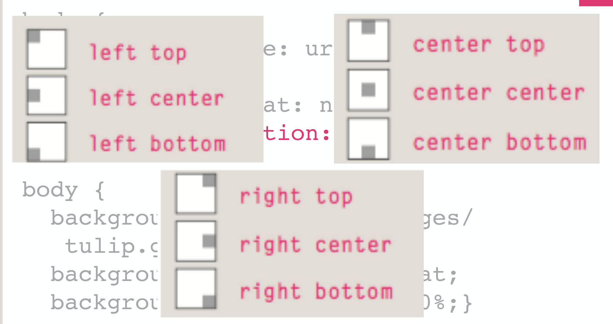

# Questions

Which one of the following elements is by defauult, an inline element?

```html
<h1>
  ,
  <li>
    ,
    <div>, <strong></strong></div>
  </li>
</h1>
```

Answer: `strong`

What font family has extra details on the ends of the main strokes of the letters?
Sarif

What font family is clearer to read with lower resolutions?
Sans-Sarif

What's the difference between pseud-class and pseudo-elements?
Pseudo-class selects element based on state,
pseudo-element only selects a part of an element

# Images

## Types of Graphics

Graphic types commonly used on web pages:

- GIF
- JPG
- PNG
- ... svg, webp

### Gif

- Graphics Interchange Format
- Best used for line art and logos
- Maximum of 256 colours + transparent
- can be animated
- uses lossless compression
- can be interlaced

### JPEG

- Joint Photographic Experts Group
- Best used for photographs
- Up to 16.7 million colours
- use lossy compression
- cannot be animated
- cannot be made transparent

### PNG

- Portable Network Graphic
- Supports millions of colours
- Support levels of transparency
- Support interlacing
- use lossless compression
- combines the best of gif and jpeg

## Image Optimization

- The process of creating an image with the lowest file size that still renders a good quality image - **balancing image quality and file size**
- Photographs taken with digital cameras are not usually optimized for the web
- Use a graphics application to:
  - Reduce image dimensions
  - Reduce size of the image file
- Just don't use a 4k Image if you don't really need it, it could harm others internet connection - You could compress it - or crop it
  Image Optimization:
- Reduce the file size of the image
- Reduce the dimensions of the image to the actual width and height of the image on the web page
- Reduce the quality of the image (Blur, Colours \rightarrow Black and white)

Helps for Search engine _indexing_ and user experience / usability

### Other file formats

- WEBP (-30%)
- AVIF (-50%)

## CSS

### Controlling sizes of the image using CSS

```css
img.large {
  width: 500px;
  height: 500px;
  /*you should not use the height because it could interfer with the ratio*/
}
img.medium {
  width: 250px;
  height: 250px;
}
.../* This does not change the image itself. CSS is only the presentation layer*/;
```

\rightarrow Layout shift

- Specifying image sizes may help pages, for example, to load the content more smoothly. This is because the HTML and CSS code will often load before the images, and telling the browser how much space to leave for an image allows it to render the rest of the page without waiting for the image to download

Should we use absolute sizes or relative? (Open question) \rightarrow Combination of both

### Images without dimensions

- (in HTML) Omitted by developers when responsive design was introduced but still required...
- Include width and height
- Do not include units (always pixels)
- Why?
  - To reserve the required space of the boxes
  - Increase usabulity

### Flexible images

\rightarrow Cumulative layout shift

```css
img {
  max-width: 100%;
  height: auto;
}
```

Predefine image space so If the Image loads later, the text won't get pushed around.

web.dev otpimize
\rightarrow It is inserted directly in the HTML

## Responsive Images HTML 5.1 Picture Element

```html
<picture>
  <source media="(min-width: 1200px)" srcset="large.jpg" />
  <!--default-->
  <source media="(min-width: 800px)" srcset="medium.jpg" />
  <source media="(min-width: 320px)" srcset="small.jpg" />
  <source src="fallback.jpg" alt="waterwheel" />
</picture>
```

Browser will decide which image to get \rightarrow saves band width

or

```html

```

Can be used to set the design focus from images for Images that would get cropped badly.

## Aligning Images using CSS

```css
img.align-left {
  float: left;
  margin-right: 10px;
}
```

Can be created to wrap text around images.
ONLY USE IF FLAOT 100% NEEDED! \rightarrow BAD RESPONSIVENESS!
Use grid or flags instead!

### Centring images using css

```css
img.align-center {
  display: block;
  margin: 0 auto; /* centering, also 0px = 0 */
}

img.medium {
  width: 250px;
  height: 250px;
}
```

**Remember**: to center block level elements using an auto margin requires that we set the width of the Element manually!

css-tricks.com centering-css-complete-guide

#### Vertical Centering

- Cenetering things vertically is a bit tricker in CSS
- There are so many different ways of doing it depending on the situation (block vs inline, know height vs unknown, ...)

## Background Images

```css
p {
  background-image: url(./image.gif);
}
```

(no quotation marks in urls)

`background-image`
Does it count as content? No \rightarrow CSS is only used for style

`baclground-repeat: repeat-x/repeat-y/repeat/no-repeat`
Is used to repeat the image so it fills the block

`background-attachment: scroll` is the default. The image will follow so you can scroll it away. With **`fixed`** it stays right in place

`background-position: left top / left center / left bottom` x and y . `50% 50%` = `center center`, The top-left corner is 0 0
(only when the background is not repeated)

The `background-size` CSS property sets the size of the element's background image. The image can be left to its natural size, stretched, or constrained to fit the available space

```css
/* first value: width of the image, second value: height */
background-size: 50% auto;
```



Shorthand notation: `background: #ffffff url(images/tulip.gif) no-repeat top right;}`
(Sets color and image)

### What selector do I use to set up a background image for the entire website?

\rightarrow Body

### Gradients

```css
#gradient {
  background-image: linear-gradient(#336666, #66cccc);
}
```
