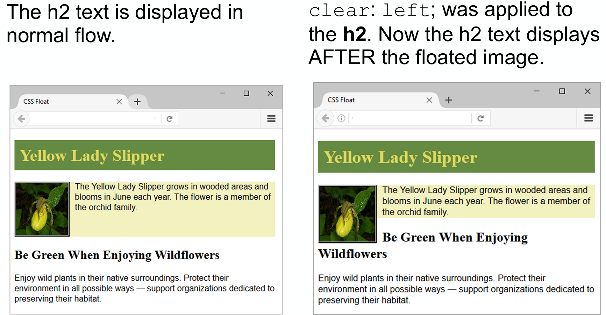
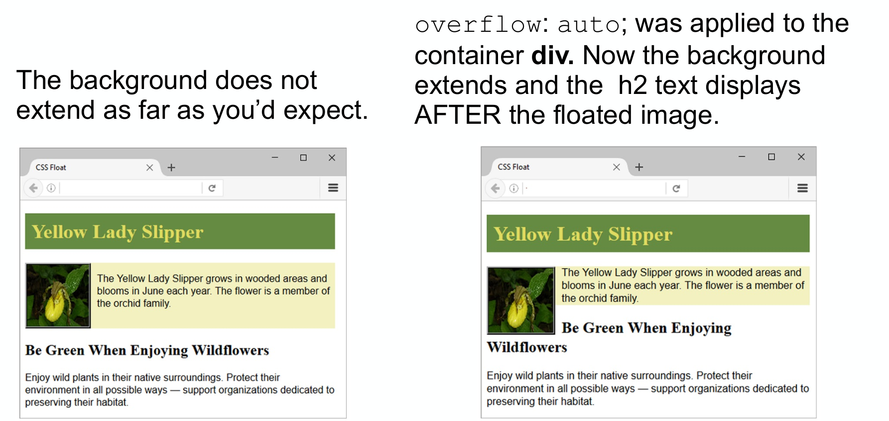
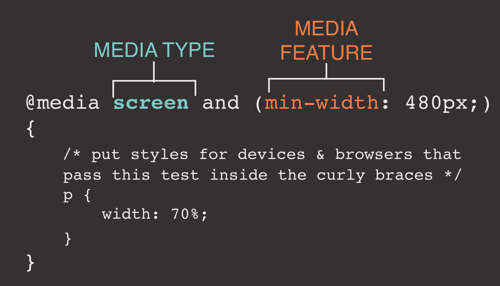

# Recap

How can we center block level elements using CSS?

- margin: 0 auto;
- (max-)width: 80%

By default, the width and height properties only take into account the size of the content (box model). How can we change these behaviours to include the margins and paddings?

- (usally widt = 100% + padding + border)
- `box-sizeing: border_box`

What CSS property and value do we need to make a background image to remain at the same position even when the user scrolls the page?

- background-attachment: fixed;

What are the differences of Pseudo Classes and Pseudo elements:

# Positioning

## Key Concepts in Positioning elements

- In containers (Main Container = Body)

## Positioning methods:

- Define exactly where element boxes will appear:
  - Relative to where they would ordinarily be (normal flow)
  - In relation to a parent element
  - relative to the viewpoint
- position CSS property - Values:
  - Static (default)
  - Relative
  - Sticky
  - Absolute
  - Fixed
- We also have float (but it is not a position value)

### Normal Flow: Position Static

- Every block-level element appears on a new line
- In order they are coded in the web page document
- Default value; the element is rendered in normal flow

### Relative Positioning (position: relative)

- This moves an element from the position it would be in normal flow, shifting it to the top, right, bottom, or left of where it would have been places
- There will be space from where the element normally would be (normal flow)
- Can lead to overlapping
- `position: relative`

```css
p.example {
  position: relative;
  top: 10px; /*moves it 10px to the left*/
  left: 100px; /*shifts it 100px to the right (100px are added on the left side)*/
}
```

### Absolute Positioning (position: absolute)

- This positions the element in relation to its containing element (parent)
- It is taken out of normal flow, meaning that it does not affect the position of any surrounding elements
- can also leads to overlapping (stuff is handled if it wasn't there)
- !! If you want to place a object inside an element, you need to make the containing element a different position (eg. relative)
- `position: absolute`

### Fixed Positioning

(Sort of Absolute)

- Positions the element in relation to the browser window/viewport (not the parent container)
- Do not affect the position of surrounding elements
- They do not move when the user scrolls up or down (it stays at the same spot)
- `position: fixed`

### Floating Elements

- This is a form of relative positioning
- Allows to take the element out of the normal flow (also removes it from the normal flow)
- Specifies that an element should be placed along the left or right side of its container
- Position the element to the far left or right of a containing box
- The floated element becomes a block-level element around which other content can flow
- DO NOT USE TO CREATE LAYOUTS
- Maybe you don't need floats anymore for creating layouts,
  - Better approaches such as flexbox or grid layout

```css
img {
  flow: right;
  /*or*/
  flow: left;
}
```

#### clear property

- Useful to "clear" or terminate a flow
- Values are left, right and both
  

#### overflow property

- Configures the display of elements on a web page
- Useful to "clear" or terminate a float before the end of a container element
- Values are `auto, hidden and scroll`
  

### Sticky

- Combines relative and fixed positioning
- Treated as relatively until its containing block crosses a specified threshold (e.g. top)
- Then treated as fixed (stuck) until meeting the opposite edge of its containing block
- VERY INTERESTING

## Overlapping elements

### z-index

Defines the stack

- z-index: 0 is the normal screen, 1 is over the normal screen...
  `z-index: 10;`

# Layouts

## Mobile Design Quick Checklist

- Small screen size
- Bandwidth issues
- Single-column layout
- Maximize contrast
- Optimize images for mobile display
- Descriptive alternate text for images
- Avoid display of non-essential content

## Layout Strategies

- Fixed layouts: Stay put at a specific pixel width regardless of the size of the browser
- Fluid (or liquid) layouts: resize proportionally when the browser window resized
- Elastic Layouts: resize proportionally based on the size of the text
- Hybrid layouts: combine fixed and scalable areas

### Fixed Layouts

Fixed layouts are created at a specific pixel width

Advantages:

- Predictable and offers better control over line length
- Easier to Design and produce
- Pixel values are accurate at controlling size and positioning of elements
  Disadvantages:
- Left over space on large screens (big gaps around the edge of a page)
- Designed for an specific screen resolution
- User needs to scroll the page horizontally on small screens

### Liquid Layouts

In liquid page layouts the page area and columns within the page get wider or narrower to fill the available space in the browser window

Advantages:

- No Horizontal scrollbars
- No unnecessary spaces around the page (large screen)
- Users can control the width of the window and content

Disadvantages:

- The design can look very different then you intended on different screen sizes
- Hard to read on large screens
- Words may be squashed in small screens

### Elastic Layouts

In elastic layout, the dimensions of the containers scale with users text size. It works by sizing all elements with em's
Advantages:

- Provides a consistent layout experience while allowing flexibility in the text size
- More control over line lengths than liquid and fixed layouts

Disadvantages:

- Is much more difficult to create
- the extra bit of usability it brings may not always seem worth it
- Not as useful for addressing device and browser size variety

### Hybrid Layouts

Combination of all of them (advantages of all of them).

Advantages:

- More flexible
- Responsive design
- share the advantages of the 3 approaches

Disadvantages:

- It can be hard to implement
- Share the disadvantages of the 3 approaches

## Layout Patterns

common patterns

- mostly fluid
- column drop
- layout shifter
- tiny tweaks
- off canvas

# Media Queries

- Allow designers to deliver styles based on media type:
  - `print`, `screen, handheld, braille`, projection, `screen`, tty, `tv` and `all`
- Can evaluate specific media features
  - `Device-width`, `orientation`, and `resolution`, etc.
- Properties (media features) can be tested for a minimum or maximum value - `min-width`, `max-resolution`, etc
  

```css
@media screen and (min-width: 480px) and (max-width: 800px) {
  /* put styles for devices & browsers that pass this test inside the curly braces */
  p {
    width: 70%;
  }
}
```

Can be chained together with `and`

You can also use the `media` tag

```html
<head>
    <link> rel="stylesheet" media="screen and ...</link>
</head>
```
