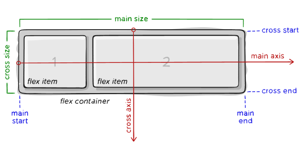
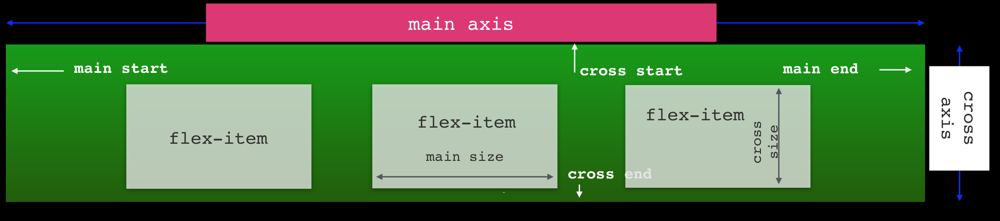
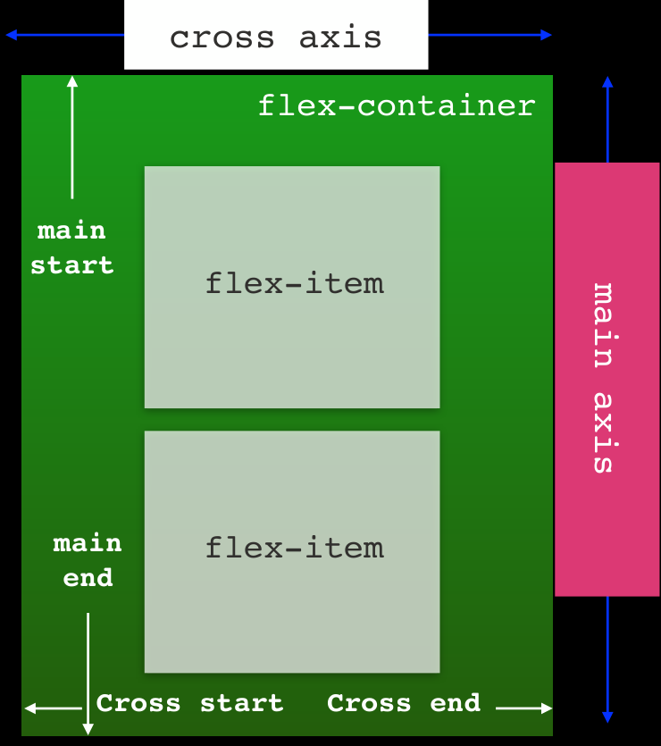
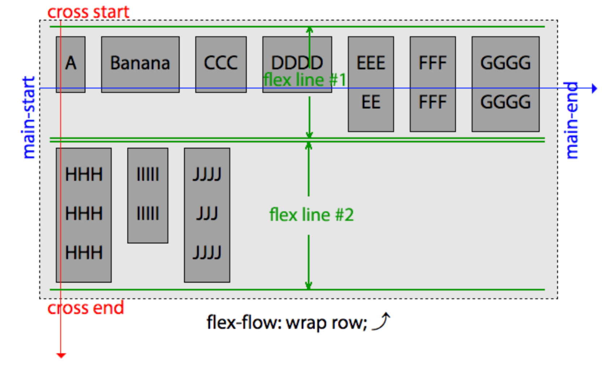

# Questions

What form of absolute positioning positions the element in relation to the browser window (not the parent container)?
-> Position: Fixed

Which CSS at-rule allows you to link to typefaces that are not installed on the users computer?
-> Font-face?

When an element is floated, which display value is the element set in?
-> Block

When using te float property, which other property are you most likely to need?
-> Width

# Flexbox

## Flexbox

> The Flexbox layout is a layout module in CSS3, made to improve items size, alignment, directions and order in a container.

### Flexbox Terminology

- everything is in the `flex-container`
- `main axis` and `cross axis` (could be horizontal and vertical)
- `main start` and `main end` (could be left and right (horizontal))
- `cross start` and `cross end` (vertical)
- Everything will be placed from main start to main end
- All of the children of the `flex-container` are `flex items`
  - they have `main size` and `cross size`
- To use flexbox layout, we need to set the display property on the parent element (container)
  

### Display: flex

- The is `flex` and `inline-flex` -> the `flex-container` only takes up as much space as it needs

```css
.flex-container {
  display: flex;
  display: -webkit-flex; /*Safari*/
}
.flex-inline-container {
  display: inline-flex;
  display: -webkit-flex; /*Safari*/
}
```

## Flexbox properties

There are several properties related to flexbox. We can group these in:

- Properties for the **container**
- Properties for the **items**

### Container Properties

#### flex-direction

- The `flex-direction` tells the browser wether the element are laid vertically or horizontally
- With row direction, items are stacked from left to right. With `row-reverse`, items stack from right to left



- If the `flex-direction` is set to column then the elements are laid from top to bottom.
- `column-reverse` does the opposite



```css
.flex-container {
  flex-direction: row; /* row-reverse / column / column-reverse */
  -webkit-flex-direction: row; /*Safari*/
}
```

- if we don't specify a direction, the default is **row**

#### Flex-wrap

- By default, a flex container will have its items placed on a single line, so flex-items will adjust to fit the container
- The flex-wrap property is used to tell the container that the items can wrap around when there's no space for them (similar to float)
- To use wrap: `flex-wrap: wrap;` or `flex-wrap: wrap-reverse;`
- `flex-wrap: nowrap;` is the default

#### flex-flow

- `flex-flow` is a shorthand property that lets us set the flex-direction and the flex-wrap values in one line

```css
.flex-container {
  flex-flow: row wrap;
}
```

#### justify-content

The justify-content property aligns items along the main axis

```css
.flex-container {
  justify-content: flex-start; /* flex-start / flex-end / center / space-between / space-around / space-evenly */
}
```

#### align-items

- The property `align-items` works pretty much like `justify-contents`, but along the cross direction of the flow (cross axis), on a flow line
- `align-items: stretch;` is the default

```css
.flex-container {
  align-items: flex-start; /* flex-start / flex-end / center / baseline / stretch */
}
```

#### align-content

The `align-content` property modifies the behaviour of the flex-wrap property. It is similar to align-items and justify-content, but instead of aligning flex items, it aligns flex lines. (only for multi-line flexboxes possible). The `align-content: stretch;` is the Default

```css
.flex-container {
  align-content: flex-start; /* flex-end / center / space-between / space-around / space-evenly / stretch */
}
```



### Item Properties

The item properties are for items inside the flex container.

#### order

Flex-items can be ordered inside a container, without changing the html code, with the order property. The default is 0 `order: 0;`

```css
.flex-item {
  order: 1;
}
```

#### flex-grow

We can decide the size of flix-items in relation to other items by using the flex-grow property.
flex-grow property is strongly discouraged by the authors of the specification itself.

```css
.flex-item {
  flex-grow: 0; /* Default */
}
```

#### flex-shrink

flex-shrink specifies how much the item will shrink in relation to others. Is also not recommended to use.

```css
.flex-item {
  flex-shrink: 0; /* Default */
}
```

#### flex-basis

flex-basis takes the initial value of the item, exactly as using width or height.

The flex-basis determines how the flex growth and shrink factors are implemented

```css
.flex-item {
  flex-basis: 80px;
}
```

-> The flex item will start out at 80px and can grow to fill up the available space
-> The flex item will start out at 80px but then shrink to fit the space available with the other items being at least min-content sized.

#### flex (shorthand)

flex-grow, flex-shrink and flex-basis can be written together in the shorthand `flex`. It is recommended to use the shorthand notation!

```css
.flex-item {
  flex: 0 1 350px; /* [ <flex-grow> <flex-shrink>? ‖ <flex-basis> ] | none */
}
```

#### align-self

`align-self` is used when you need to override align-items for a specific flex-item.

```css
.flex-item {
  align-self: auto; /* Default */
  /* auto | flex-start | flex-end | center | baseline | stretch */
}
```
