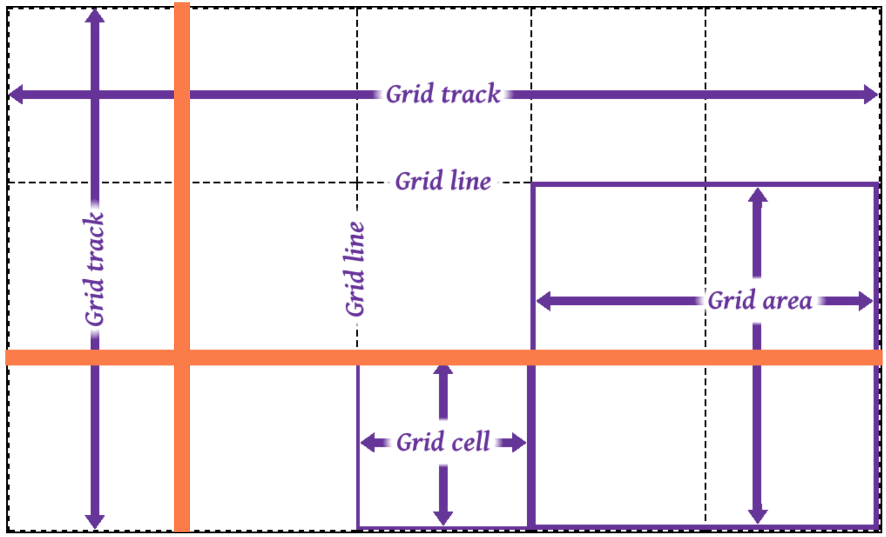
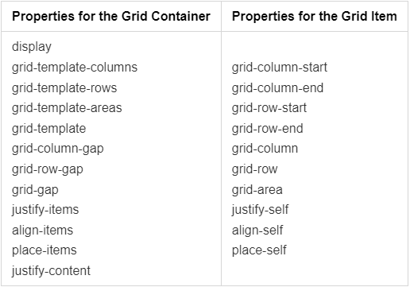
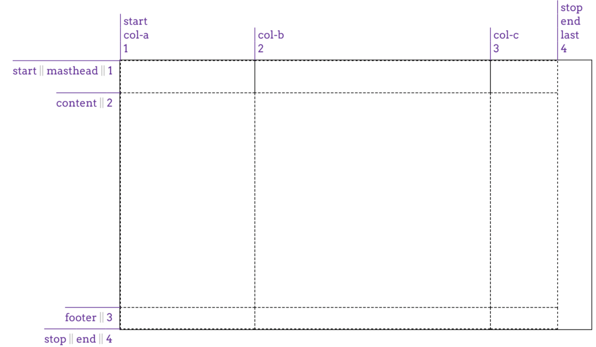
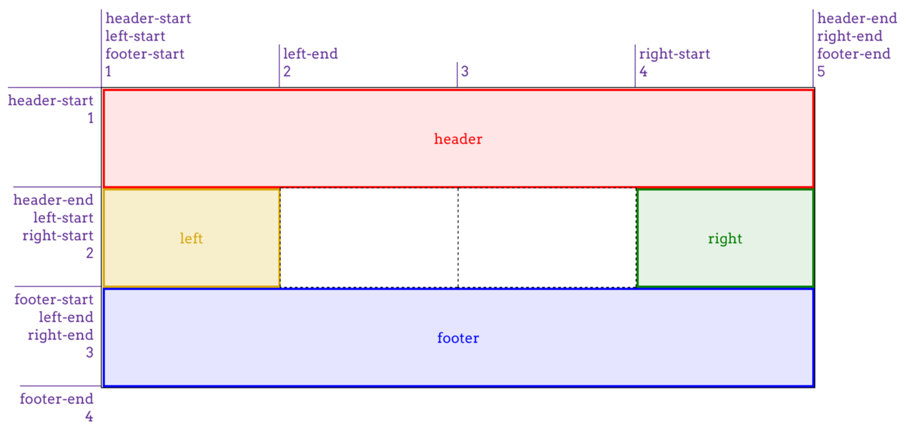
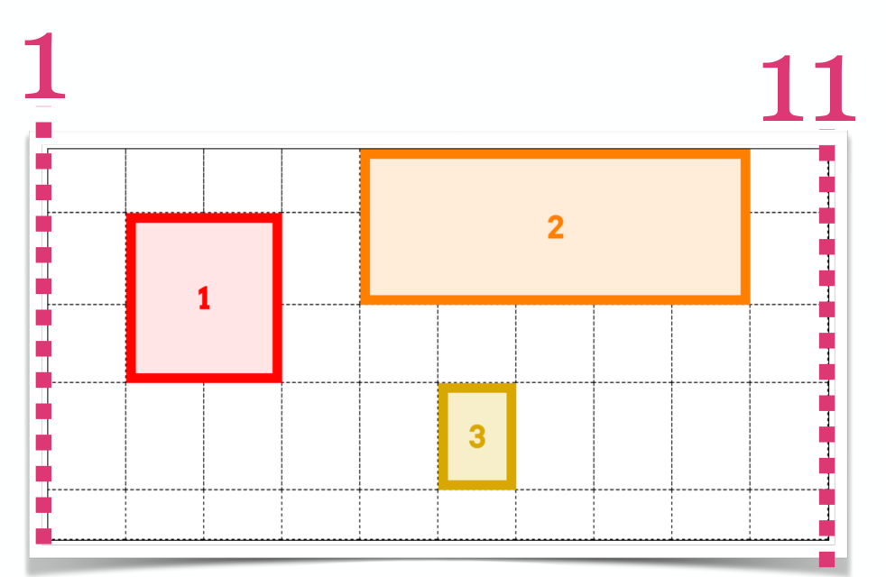

# Grid layout

## Grid Layout definition

The CSS Grid Layout is a layout module in CSS3 that offers a grid-based layout system which aims to make it easier to design web pages without having to use floats and positioning.

- Grid layout is a generalised layout system (2 dimensions)
  - rows
  - columns
- Grid allows pieces of the design:
  - to be laid out independently of their document source order
  - to overlap pieces of the layout

### Terminology

- The most fundamental unit is the grid line
- by defining the placement of one or more grid lines,
- you implicitly create the rest of the grids components



- A grid track is a continuous run between two adjacent grid lines
  - In other words, columns and rows
- A grid cell is any space bounded by four grid lines, with no grid lines running through it
  - in other words, something similar to a table cell
  - Grid cells cannot be directly addressed with CSS grid properties
- A grid area is any rectangular area bounded by four grid lines and made up of one or more grid cells
  - Grid areas are directly addressable by CSS grid properties

## Grid Properties

Working with grid layouts implies working with grid lines.

Grid tracks, cells, and areas are entirely constructed of grid lines, and more importantly, do not have to correspond to grid items.



### Grid container props

#### Display: grid

To use the grid layout, we need to set the display property on the parent element (container)

```css
.grid-container {
  display: grid; /*inline-grid;*/
}
```

#### Placing Grid lines

##### grid-template-columns & grid-template-rows

- Used for placing column and row grid lines
- Formal syntax: `none | <track-list> | <auto-track-list>`

```css
.grid-container {
  display: grid;
  grid-template-rows: 20% 1fr 20%;
  grid-template-columns: 100px max-content 1fr;
  /* none / auto / max-content / min-content / length / initial / inherit; */
  /*shorthand:*/
  grid-template: 20% 1fr 20% / 100px max-content 1fr;
  /*rows then columns*/
}
```

##### Fixed-Width (inflexible) Grid Tracks

- Grid tracks are a fixed width (e.g.: pixels or ems)
- Percentages also count as fixed-width here
- "fixed-width" means the grid lines are placed such that the distance between them does not change due to changes of content within the grid track

```css
.grid-container {
  display: grid;
  grid-template-columns: 200px 50% 100px;
  /*(50% of the grid container)*/
}
```

##### Flexible Grid Tracks

Based on the

1. amount of space not consumed by inflexible tracks
2. actual content of the entire track

`fr` (fractional unit): divide up whatever space is available by some fraction

```css
.grid-flexible-container {
  display: grid;
  grid-template-columns: 1fr 2fr 1fr;
}
/* or */
.grid-flexible-mix-container {
  display: grid;
  grid-template-columns: 200px 50% 100px 1fr 1fr;
  /* the last two fr are really small and occupie the remaining space from the container*/
}
```

- `minmax(min,max)`: defines a size range, greater than or equal to min, and less than or equal to max
- `min-content`: the largest minimal content contribution of the grid items occupying the grid track
- `max-content`: largest maximal content contribution of the grid items occupying the grid track
  Example:

```css
.grid-minmax {
  display: grid;
  grid-template-rows: max-content minmax(3em, 100%) min-content;
}
```

##### Repeating Grid lines:

- `repeat()`: to set up a bunch of grid tracks of the same size. `repeat(5, 1fr)`
- also possible:
  - to repeat patterns `repeat(5, 2em 1fr)` (repeats 5x)
  - to repeat concat grid tracks `repeat(5, 2em 1fr) 100px` (after the last element from the repetition there will be new one with 100px)

##### Auto-filling tracks

- `auto-fill` can be used to set up a simple pattern and repeat it until the grid container is filled

```css
.grid {
  grid-template-rows: repeat(auto-fill, 5em);
  grid-row: 2;
}
```

#### Placing Grid lines tipps

Some facts about grid lines:

- Grid lines can always be referred to by number (starting from 1)
- They can also be named by the author
- Same grid line can have more than one name
- They can be named using a square bracket notation
  `grid-template-columns: [start col-a] 200px [col-b] 50% [col-c] 100px [stop end last];`
  (start/col-a are names, but start and end are always there)
  

#### grid-template-areas

Used to define template areas

- Repeating the name of a grid area causes the content to span those cells
- A period signifies an empty cell
- The syntax itself provides a visualization of the structure of the grid
- It can be named using a square bracket notation

```css
#grid {
  display: grid;
  grid-template-areas:
    "header heade header header"
    "left ... ... right"
    "footer footer footer footer";
  /* you can also adjust the size */
  grid-template-rows: 1fr 1fr 1fr 1fr;
  grid-template-columns: 1fr 1fr 1fr 1fr;
}
```



#### Grid gaps

- `grid-column-gap`, `grid-row-gap` and `grid-gap` specify the size of the grid lines.

```
grid-row-gap: 1em;
grid-column-gap: 3em;
grid-gap: row-gep-legth column-gat-length \rightarrow grid-gap: 1em 3em; = shorthand
```

#### justify-items

horizontal alignment of grid items

```css
.grid {
  justify-items: start; /* end / center / stretch */
}
```

#### align-items

Vertical alignment of grid items

```css
.grid {
  align-items: start; /* end / center / stretch */
}
```

#### justify-content

Horizontal alignment of grid contents (i.e. all the grid items when the grid container is greater than the sum of grid items)

```css
.grid {
  justify-content: start; /* end / center / stretch */
}
```

#### place-items

shorthand for `align-items / justify-items`

```css
.start-end {
  place-items: start end;
}
```

### Grid item Properties

#### Attaching Elements to the grid

grid-row-start, grid-row-end, grid-column-start, grid-column-end

- used for attaching elements to a grid-line
- Formal syntax: `<number> | <name> | span <number> | span <name> | auto`
- Using grid-line numbers to say where and how the elements should be placed within the grid
- Column numbers count from left to right
- Row numbers from top to bottom
- numbers start from 1

```css
.box01 {
  grid-row-start: 2; /* from top to bottom second line */
  grid-row-end: 4; /* from top to bottom forth line */
  grid-column-start: 2; /* from left to right second line */
  grid-column-end: span 2; /* spans 2 grid cells from start */
}
```



- Another way to say that same thing is by replacing the ending values by span
- Supplying span with a number means "span across this many grid tracks"
- Supplying only span is the same as span 1

- Another way to say that same thing is by replacing the values by the named grid lines (named lines example)

```css
.header {
  grid-row-start: header-start;
  grid-row-end: header-end;
  grid-column-start: header-start;
  grid-column-end: header-end;
}
```

##### Shorthand:

- grid-row and grid column are a shorthand for:
  - `grid-row-start + grid-row-end` and `grid-column-start + grid-column-end`
  - `grid-area` (shorthand)

```css
.leftside {
  grid-column: left-start / left-end; /* named lines example*/
  grid-row: left-start / left-end;
  grid-area: 1 / 1 / 3 / 6; /* row start / col start / row end / col end */
}
```

#### justify-items

Horizontal alignment of the grid item. Overrides container grid value

```css
.item {
  justify-self: start; /* end / center / stretch */
}
```

#### align-self

Vertical alignment of the grid item. Overrides container grid value

```css
.item {
  align-self: start; /* end / center / stretch */
}
```

#### place-items

Shorthand for `<align-tems> / <justify-items>`

```css
.start-end {
  place-items: start end;
}
.end-end {
  place-items: end;
}
```

## Difference between flex and Grid

!!! warning Difference between Flex and grid
  Flex: single dimension. Grid: 2 dimension
